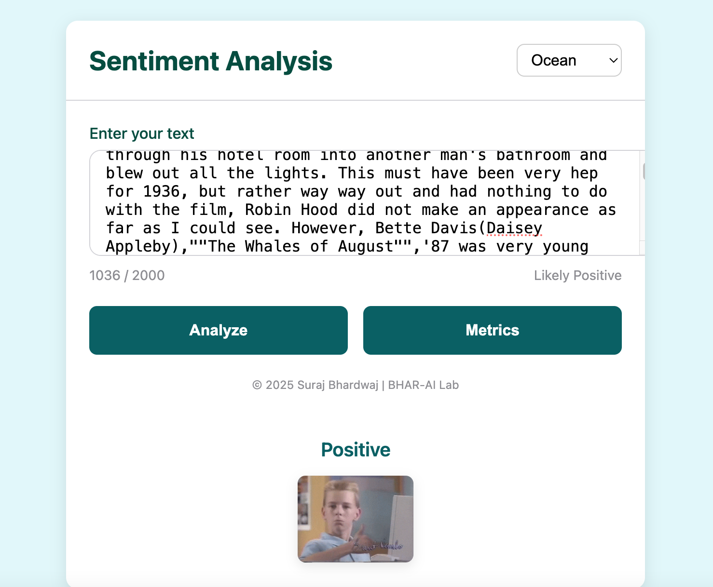
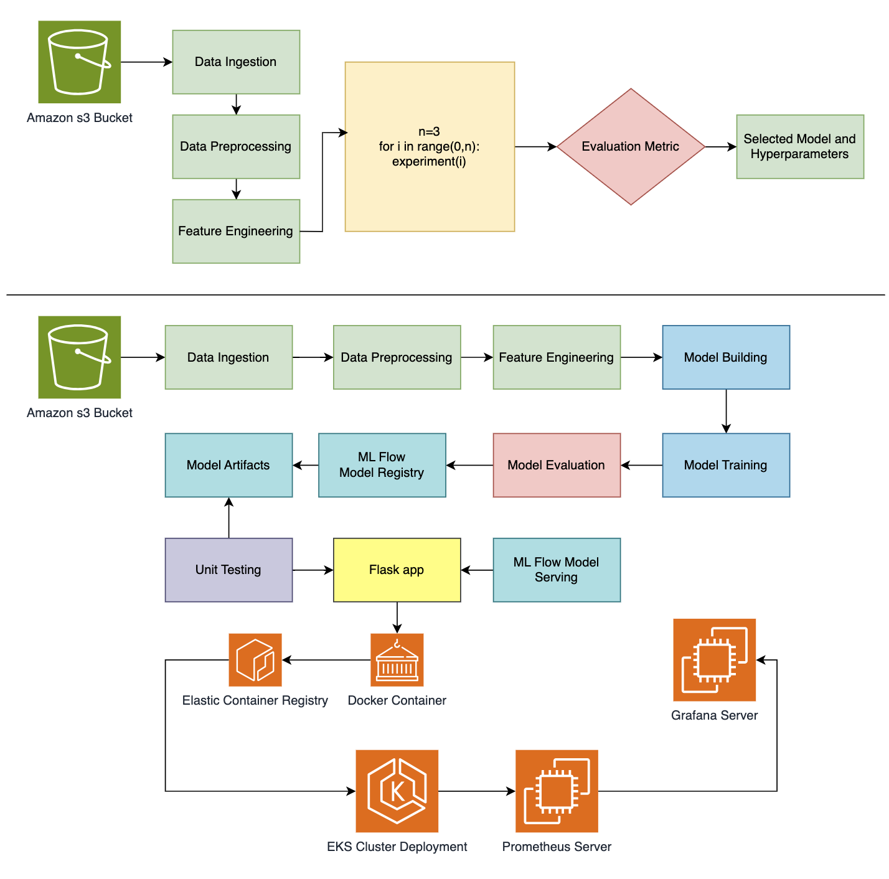
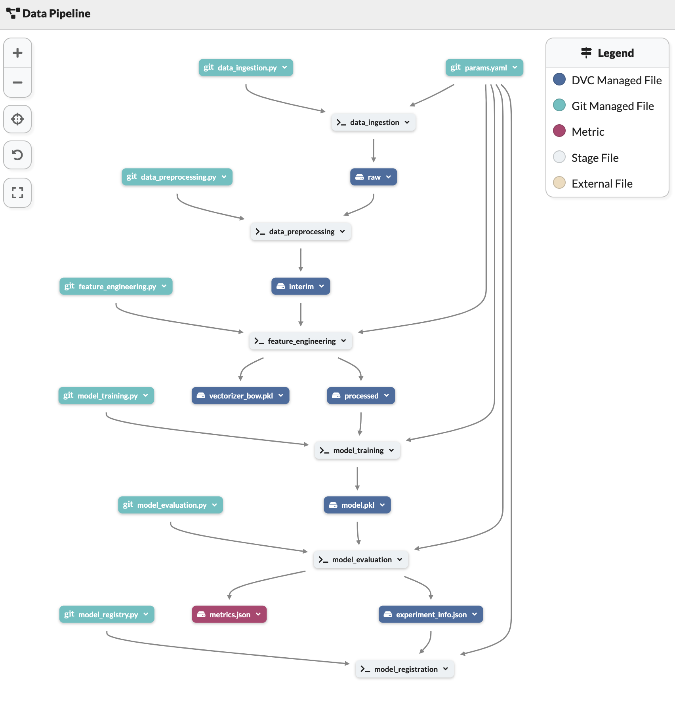
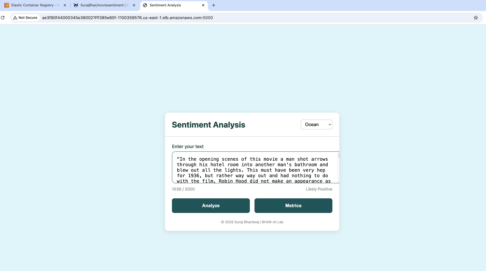
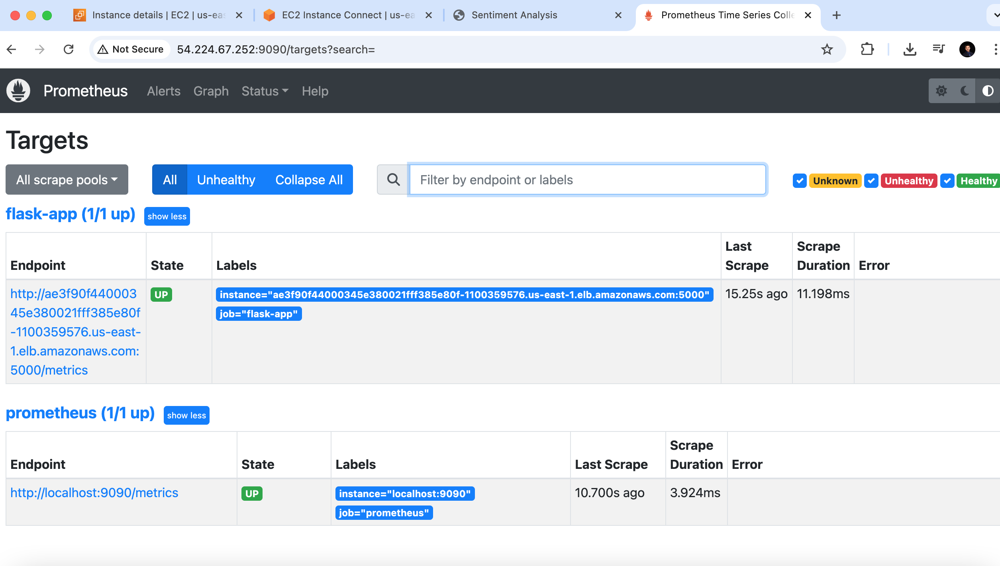
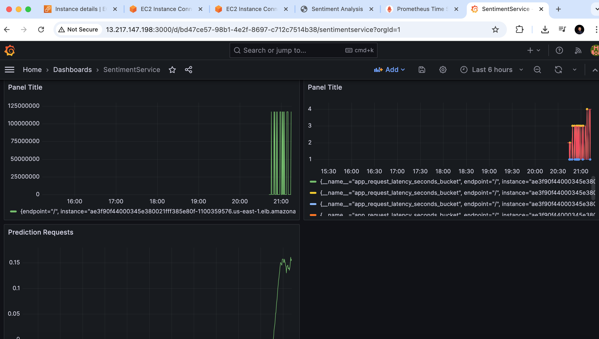

# Movie Sentiment Prediction Microservice
[](https://github.com/SurajBhar/moviesentiment/actions/workflows/ci.yaml)
[](https://github.com/SurajBhar/moviesentiment/blob/main/LICENSE)

> **Predict audience sentiment on movie reviews instantly with a fully automated, production-grade platform—scalable, containerized, and Kubernetes-ready.**



**Key Features:**

* **Data Ingestion**
  Automatically pulls raw review data from an AWS S3 bucket.
* **Experiment Tracking & Serving**
  Leverages MLflow to log experiments, register models, and serve real-time predictions.
* **Dataset Versioning & Collaboration**
  Uses DVC and DagsHub to manage versioned datasets and enable team collaboration.
* **CI/CD & Source Control**
  Maintains code in GitHub with GitHub Actions automating testing, builds, and deployments.
* **Containerized Deployment**
  Packages each service in Docker and orchestrates them on Amazon EKS (Kubernetes).
* **Monitoring & Alerting**
  Collects performance and health metrics via Prometheus and visualizes them in Grafana.

---

Altogether, the Movie Sentiment Prediction Microservice delivers an end-to-end workflow—from raw data to live inference—so you can develop, deploy, version, and monitor sentiment models in production with confidence.

---

## Table of Contents

1. [Architecture Overview](#architecture-overview)
2. [Prerequisites](#prerequisites)
3. [Setup & Installation](#setup--installation)
4. [Environment Variables](#environment-variables)
5. [Data Pipeline](#data-pipeline)
6. [Modeling](#modeling-future-work-extend-with-deep-learning-models)
7. [Web Service](#web-service)
8. [Infrastructure](#infrastructure)
9. [Deployment on EKS](#deployment-on-eks)
10. [Monitoring & Dashboarding](#monitoring--dashboarding)
11. [Tech Stack](#tech-stack)
12. [Contributing](#contributing)
13. [Support](#support)
14. [License](#license)

---

## Architecture Overview



---

## Prerequisites

* **Git** (≥2.30)
* **Conda** (Miniconda/Anaconda)
* **Docker**
* **AWS CLI** (configured)
* **kubectl** & **eksctl** (for EKS)

---

## Setup & Installation

   ```bash

   #1. Clone the repository
   git clone https://github.com/SurajBhar/moviesentiment.git
   cd moviesentiment

   # 2. Create & activate Conda environment
   conda create -n senti python=3.10
   conda activate senti

   # 3. Install dependencies
   pip install --upgrade pip
   pip install -r requirements.txt

   # 4. Run full DVC pipeline
   dvc repro

   # 5. Run Uni test on Model
   python -m unittest tests/test_model.py

   # 6. Promote model to Production
   python scripts/promote_model.py --ci-cd

   # 7. Run Flask app tests & Run flask app locally
   python -m unittest tests/test_flask_app.py
   python flask_app/app.py

   # 6. Add Secrets to your Github actions secrets & variables
   # Copy the secrets from the .env file (Add Your AWS credentials)

   # 7. Setup your AWS account for deployment

   # 8. Follow the ci.yaml file for deployment
      - Login to AWS ECR 
      - Build Docker image 
      - Tag Docker image 
      - Push Docker image to ECR
      - Create Kubernetes Secret 
      - Deploy to EKS

   # 9. After deployment access the app at the 5000 port with External IP
   - You can get your external ip using following command
   - kubectl get svc <flask-app-service-name>
   # An example: <Your External IP>:5000
   ae3f90f44000345e380021fff385e80f-1100359576.us-east-1.elb.amazonaws.com:5000

   ````

---

## Environment Variables

Create a `.env` file in project root to set up your secrets & variables:

   ```ini
   # CI/CD flag
   CI_CD=false
   # DagsHub / MLflow
   CAPSTONE_TEST=<your-dagshub-token>
   # AWS / S3
   AWS_ACCESS_KEY_ID=<your-aws-key>
   AWS_SECRET_ACCESS_KEY=<your-aws-secret>
   AWS_REGION=us-east-1
   S3_BUCKET_NAME=<your-bucket>
   S3_TEST_FILE_KEY=<dataset.csv>
   ECR_REPOSITORY=moviesentiment
   AWS_ACCOUNT_ID=<IAMUserAccountID>
   ```

---

## Data Pipeline



Stages defined in `dvc.yaml`:

* `data_ingestion`
* `data_preprocessing`
* `feature_engineering`
* `model_building`
* `model_evaluation`
* `model_registration`

Run full repro:

```bash
dvc repro
```
---

## Modeling (Future Work: Extend with Deep Learning Models)

* **Algorithms**: Logistic Regression (configurable via `params.yaml`), extensible to Random Forest, Neural Nets, etc.
* **Hyperparameters** stored in `params.yaml` for reproducibility.
* **Experiment tracking**: MLflow with remote URI at `<DAGSHUB_URL>`.

## Web Service

* Flask microservice in `flask_app/` exposing `/predict` and `/metrics`.
* Secrets managed via `.env`, Actions secrets and variables and Kubernetes Secrets.

## Infrastructure

* **CI/CD**: GitHub Actions (`.github/workflows/ci.yaml`)

  1. Checkout, Python setup, `pip install`
  2. `dvc repro` → unit & integration tests → model promotion
  3. Docker build & push to ECR
  4. `kubectl apply` of `deployment.yaml`


## Deployment on EKS

  * `deployment.yaml` runs 2 replicas of `moviesentiment:latest` (Microservice) on EKS
  * LoadBalancer service on port 5000
1. **Build & push Docker image**:

   ```bash
   docker build -t ${{ secrets.ECR_REPOSITORY }}:latest .
   docker push ${{ secrets.AWS_ACCOUNT_ID }}.dkr.ecr.${{ secrets.AWS_REGION }}.amazonaws.com/${{ secrets.ECR_REPOSITORY }}:latest
   ```
2. **Create EKS cluster** (or use existing):

   ```bash
   eksctl create cluster --name moviesentiment-cluster \
   --region us-east-1 --nodegroup-name moviesentiment-nodes \
   --node-type t3.small \
   --nodes 1 --nodes-min 1 \
   --nodes-max 1 \
   --managed
   ```
3. **Apply Kubernetes manifests** (in `k8s/`):
   An example:
   ```bash
   kubectl apply -f k8s/deployment.yaml
   ```

---

## Monitoring & Dashboarding


* **Prometheus**: Scrapes Flask metrics every 15 s via `/metrics`.


* **Grafana**: Dashboards visualize throughput, latency, error rates, and sentiment distribution.
  * Request rate & latency
  * Prediction distribution
  * Resource metrics

---

## Tech Stack

| Layer                  | Technology                     |
| ---------------------- | ------------------------------ |
| Data Storage           | AWS S3                         |
| Experiment Tracking, Model Registry & Model Serving    | MLflow                         |
| Collaboration, Pipeline Automation & Data Versioning    | DagsHub, DVC                   |
| Source Control         | Git, GitHub                    |
| CI/CD                  | GitHub Actions                 |
| Containerization       | Docker                         |
| Orchestration| Amazon EKS (Kubernetes), `eksctl`, `kubectl`       |
| Secrets & Config               | python-dotenv, GitHub Actions Secrets, Kubernetes Secrets            |
| Monitoring & Alerts    | Prometheus, Grafana            |

---

## Contributing

1. Fork the repository
2. Create a branch: `git checkout -b feature/XYZ`
3. Make changes & add tests
4. Commit & push: `git push origin feature/XYZ`
5. Open a Pull Request

---

## Support

For questions or issues, please open an [issue](https://github.com/SurajBhar/moviesentiment/issues) or write a message to me on [Linkedin](https://www.linkedin.com/in/bhardwaj-suraj/).

If you want to fully replicate this project or want to extend it don't hesitate to contact me. I will be more than happy to provide you with my settings for the deployment, monitoring and dashboarding.

---

## License
MIT License

Copyright (c) 2025 Suraj Bhardwaj

Permission is hereby granted, free of charge, to any person obtaining a copy
of this software and associated documentation files (the "Software"), to deal
in the Software without restriction, including without limitation the rights
to use, copy, modify, merge, publish, distribute, sublicense, and/or sell
copies of the Software, and to permit persons to whom the Software is
furnished to do so, subject to the following conditions:

The above copyright notice and this permission notice shall be included in all
copies or substantial portions of the Software.

THE SOFTWARE IS PROVIDED "AS IS", WITHOUT WARRANTY OF ANY KIND, EXPRESS OR
IMPLIED, INCLUDING BUT NOT LIMITED TO THE WARRANTIES OF MERCHANTABILITY,
FITNESS FOR A PARTICULAR PURPOSE AND NONINFRINGEMENT. IN NO EVENT SHALL THE
AUTHORS OR COPYRIGHT HOLDERS BE LIABLE FOR ANY CLAIM, DAMAGES OR OTHER
LIABILITY, WHETHER IN AN ACTION OF CONTRACT, TORT OR OTHERWISE, ARISING FROM,
OUT OF OR IN CONNECTION WITH THE SOFTWARE OR THE USE OR OTHER DEALINGS IN THE
SOFTWARE.
